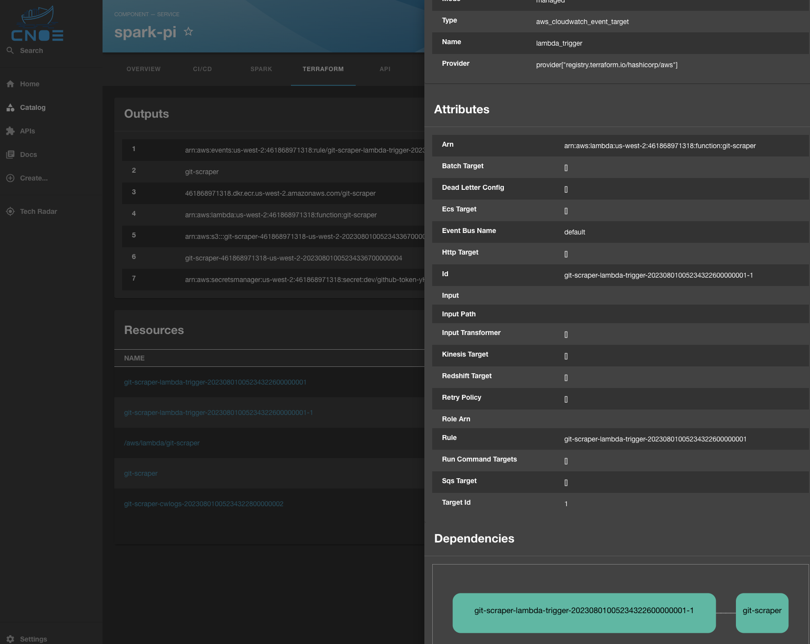

# Terraform Backstage Plugin

Welcome to the Terraform plugin! This plugin can show Terraform outputs/resources from TFState files associated with a particular Backstage components. It does this by utilizing various annotations which point to where the TFState might be stored. It will then fetch those files, parse them, and display them in a Backstage component. 

## Getting started

### Terraform State Files
This plugin supports three storage locations for Terraform state files (tfstate): K8s secrets, S3 and local file systems. S3 will require additional configuration for AWS credentials to access S3. To access local file systems, the terraform backend will need proper file permissions to access those files.

### Configuration - Frontend

Entities must be annotated with Kubernetes annotations. An example component
would look like the following where you can configure the `spec` to your
liking. Information specific to Terraform goes under `annotations` as 
shown below:

```yaml
apiVersion: backstage.io/v1alpha1
kind: Component
metadata:
  name: backstage
  annotations:
    terraform.cnoe.io/s3-bucket: backstage-terraform-plugin
    terraform.cnoe.io/s3-prefix: tfstates/
    terraform.cnoe.io/local-filepath: /var/lib/tfstatefiles
    terraform.cnoe.io/secret-name: secret
    terraform.cnoe.io/secret-namespace: namespace
spec:
  type: service
  lifecycle: experimental
  owner: user1
  system: system1
```

Update your Entity page. 

For example if you have want to have a Terraform link in the top toolbar to expand to a new page: 
```typescript
// in packages/app/src/components/catalog/EntityPage.tsx
import { isTerraformAvailable, TerraformPluginPage } from '@cnoe-io/plugin-terraform';
...
const terraFormContent = (
  <TerraformPluginPage />
);
...
const websiteEntityPage = (
  <EntityLayout>
  ...
    <EntityLayout.Route path="/terraform" title="Terraform" if={isTerraformAvailable}>
      {terraFormContent}
    </EntityLayout.Route>
  </EntityLayout>
...
);
```

If you want to have the Terraform outputs/resources tables on the overview Entity page:
```typescript
// in packages/app/src/components/catalog/EntityPage.tsx
const overviewContent = (
  <Grid container spacing={3} alignItems="stretch">
    ...
    <EntitySwitch>
      <EntitySwitch.Case if={e => isTerraformAvailable(e)}>
        <Grid item md={6}>
          <TerraformPluginPage />
        </Grid>
      </EntitySwitch.Case>
    </EntitySwitch>
  ...
  </Grid>
);
```

#### Annotations
As shown in the example above, the following annotations could go under
`annotations` in the backstage `Component` and will be recognized by this plugin.

- One of the three annotations below are required:
- `terraform.cnoe.io/s3-bucket`: Optional. The S3 bucket where tfstate files would be stored.
- `terraform.cnoe.io/local-filepath`: Optional. The local file system path of where tfstate files would be stored.
- If storing tfstate files in S3, you can optionally define a prefix:
- `terraform.cnoe.io/s3-prefix`: Optional. This is a S3 prefix of where tfstate files would be stored in the S3 bucket.
- `terraform.cnoe.io/secret-name`: Optional. The secret name where the tfstate file would be stored in the K8s cluster.
- `terraform.cnoe.io/secret-namespace`: Optional. The namespace of the secret.

Note: The plugin only supports using one storage location at a time. It looks at the following annotations in this order:

- secret-name/secret-namespace
- s3-bucket/s3-prefix
- local-filepath

### Configuration - Backend

In `packages/backend/src/index.ts`, import the backend plugin.

```typescript
...
// cnoe plugins
backend.add(authModuleKeycloakOIDCProvider);
backend.add(cnoeScaffolderActions);
backend.add(import('@internal/backstage-plugin-terraformv2-backend'));

backend.start();
...
```

### Authentication

#### AWS Credentails

By default, the Terraform backend plugin relies on the [default behavior of the AWS SDK for Javascript](https://docs.aws.amazon.com/AWSJavaScriptSDK/v3/latest/modules/_aws_sdk_credential_provider_node.html) to determine the AWS credentials that it uses to authenticate an identity to use with AWS APIs.

The Terraform backend plugin that runs in your Backstage app searches for credentials in the following order:

1. Environment variables (`AWS_ACCESS_KEY_ID`, `AWS_SECRET_ACCESS_KEY`)
1. SSO credentials from the token cache
1. Web identity token credentials (including running in an Amazon EKS cluster using IAM roles for service accounts)
1. Shared credentials and config ini files (`~/.aws/credentials`, `~/.aws/config`)
1. Amazon Elastic Container Service (Amazon ECS) task metadata service
1. Amazon Elastic Compute Cloud (Amazon EC2) instance metadata service

We recommend that you don't hard-code long lived AWS credentials in your production Backstage application configuration. Hard-coding credentials is risky and might expose your access key ID and secret access key.

Instead, we recommend that you use short lived AWS credentials for your production Backstage application by deploying it to Amazon ECS, Amazon Elastic Kubernetes Service (Amazon EKS), or Amazon EC2. For more information about deploying Backstage to Amazon EKS using a Helm chart or to Amazon ECS on AWS Fargate using the AWS Cloud Development Kit (CDK), see [Deploying Backstage](https://backstage.io/docs/deployment/) in the Backstage documentation.

To use multiple AWS accounts with your Backstage app or to explicitly configure credentials for an AWS account, you can configure AWS accounts in your Backstage app's configuration.
For example, to configure an AWS account to use with the Terraform backend plugin which requires using an IAM role to retrieve credentials, add the following to your Backstage app-config.yaml file.

```yaml
aws:
  accounts:
    - accountId: '111111111111'
      roleName: 'my-iam-role-name'
```

For more account configuration examples, see the [Backstage integration-aws-node package documentation](https://www.npmjs.com/package/@backstage/integration-aws-node).

## IAM permissions

The Terraform backend plugin requires the AWS identity that it uses to have the following IAM permissions for getting tfstate files from S3:

* s3:GetObject
* s3:ListObjectsV2

## Diagram


